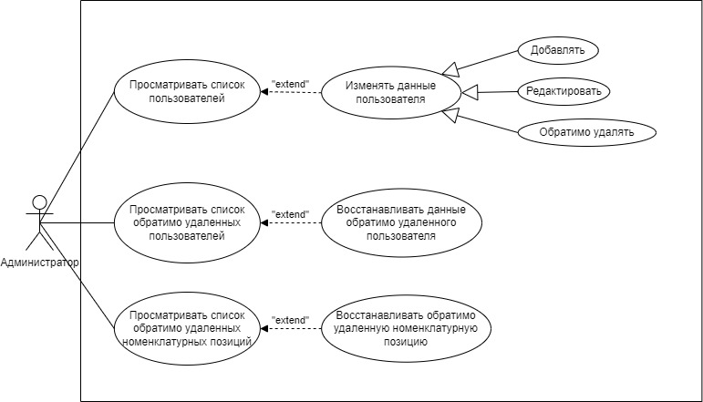

<h1 align="center">АИС учета 
изделий и заказов на их изготовление</h1>

<h1>Содержание</h1>

<ol>
    <li>
      <a href="#about-the-project">О проекте</a>
      <ul style="list-style-type:disc">
        <li><a href="#introduction">Введение</a></li>
        <li><a href="#why-not-erp">Почему не ERP?</a></li>
        <li><a href="#why-it-is-better-than-erp">Чем разработанная АИС лучше перечисленных ERP-систем?</a></li>
        <li><a href="#stack">Стек</a></li>
        <li><a href="#use-case">Use case</a></li>
        <li><a href="#input-and-output-data-description">Описание входных и выходных данных</a></li>
        <li><a href="#er-diagram">ER-диаграмма</a></li>
        <li><a href="#triggers">Триггеры</a></li>
        <li><a href="#middleware-and-rules">Специфика предметной области (middleware и кастомные правила валидации)</a></li>
        <li><a href="#screenshots">Некоторые скриншоты интерфейса</a></li>
      </ul>
    </li>
    <li>
      <a href="#getting-started">Начало работы</a>
      <ul style="list-style-type:disc">
        <li><a href="#installation">Установка</a></li>
        <li><a href="#testing">Тестирование</a></li>
      </ul>
    </li>
    <li><a href="#contact">Контакты</a></li>
</ol>

<h1 id="about-the-project">О проекте</h1>

<h2 id="introduction">Введение</h2>

<div align="justify">

<p>Любое промышленное предприятие 
тратит определенное количество времени 
на планирование производства (формирование 
порядка изготовления заказов, приоритизация 
выполнения заказов). Степень автоматизации 
именно этого бизнес-процесса оказывает 
наибольшее влияние на весь производственный 
процесс, поскольку именно этап планирования 
производства включает в себя больше всего 
расчетов, от качества которых зависит весь 
дальнейший процесс производства.</p>

<p>Главным образом эти расчеты 
связаны с определением необходимого для 
выполнения заказа количества сырья, 
материалов, комплектующих, а также с 
определением их дефицита.</p>

<p>Эти расчеты достаточно сложны 
для проведения вручную, поскольку необходимое для 
выполнения заказа количество сырья, материалов, 
комплектующих должно рассчитываться с учетом 
спецификаций составляющих заказа 
(сборочные единицы состоят из деталей, 
детали – из металла или пластмассы, 
сборочные единицы и детали могут иметь 
гальваническое покрытие, которое в свою очередь 
состоит из металлов и химикатов и т.д.). 
При этом необходимое количество должно быть 
рассчитано для каждой составляющей заказа 
по всей иерархии, учитывая, что спецификации 
составлены на единицу изделия.</p>

<p>Более того, необходимое для выполнения заказа 
количество сырья, материалов, комплектующих 
должно рассчитываться с учетом количества, 
необходимого на все более приоритетные заказы.</p>

<p>Определение приоритета также не просто для 
проведения вручную. Необходимо рассчитать 
совокупное время на выполнение заказа 
(на основании технологических маршрутов всех 
составляющих заказа по всей иерархии). 
Это время прибавляется к дате запуска заказа 
в производство, далее вычисляется разница 
между датой закрытия заказа и полученной датой. 
Чем меньше эта разница, тем приоритетнее 
выполнение заказа.</p>

<p>Проведение этих расчетов 
вручную приводит к ошибкам, из-за которых 
происходит нарушение сроков отгрузки заказов.</p>

<p>В текущей реализации АИС также 
предусмотрена возможность планирования закупок: 
указание точки заказа для покупных изделий, 
производство и транспортировка которых требуют 
времени, во избежание формирования их дефицита, 
а также сигнализация о том, какие покупные 
изделия достигли своей точки заказа. Эта 
возможность необходима, т.к. многие покупные 
изделия нельзя привезти быстро: у контрагентов 
уходит некоторое время на изготовление изделий, 
на их транспортировку и только потом – на 
доставку предприятию.</p>

<p>При этом при завершении 
производства заказа автоматически вычитается 
кол-во всех его составляющих (по всех иерархии) 
из общего кол-ва.</p>
</div>

<h2 id="why-not-erp">Почему не ERP?</h2>

<div align="justify">
<p>
<a href="https://www.edit-pro.ru/news/integratsiya-po-russki-kak-otechestvennye-erp-sistemy-zamenyat-zarubezhnye/">
По оценкам «Эдит про»</a> до начала 
трансформации рынка в 2022 г. 
распределение долей ключевых игроков на 
российском рынке ERP в 2021 году выглядело так: 
SAP – 45%, 1С – 40%, Microsoft – 10%, Oracle – 7%, 
«Галактика» – 5%. При этом часть крупных компаний 
работает одновременно с решениями иностранных 
вендоров и 1С.</p>

<p>В течение ближайших двух лет 
доля 1С может вырасти до 75%. Остальной рынок 
распределится между другими российскими 
разработчиками: «Галактика», «Парус», «Компас».</p>

<p>
Компании <a href="https://news.sap.com/2022/04/sap-plans-russia-exit/">SAP</a>, 
<a href="https://www.oracle.com/corporate/conflict-in-ukraine/russia/">Oracle</a> и 
<a href="https://blogs.microsoft.com/on-the-issues/2022/03/04/microsoft-suspends-russia-sales-ukraine-conflict/">Microsoft</a> 
прекратили работу в РФ. Поэтому с учетом 
трансформации рынка в 2022 г. рассматривались 
следующие ERP-системы: 1С, «Галактика», «Компас» 
и «Парус».</p>

<p>В них можно реализовать 
необходимый функционал.</p>

<p>Однако все перечисленные 
ERP-системы обладают рядом существенных 
недостатков.</p>

<p>Эти недостатки включают 
в себя следующие пункты:</p>

<ol>
<li>Сложность внедрения.</li>

<li>Неудобство пользовательского интерфейса.</li>
</ol>

<p>Под сложностью внедрения 
подразумевается наличие сопутствующих издержек 
на каждом этапе внедрения каждой из этих систем, 
причем не только финансовых. Эти издержки 
включают в себя следующие пункты:</p>

<ul>
<li>необходимость в первоначальной настройке 
системы, требующей привлечения стороннего 
специалиста;</li>

<li>необходимость в обучении персонала;</li>

<li>необходимость в доработке системы, 
требующей привлечения стороннего специалиста;</li>

<li>необходимость в найме сторонней организации, 
которая будет сопровождать систему в течение 
всего срока ее эксплуатации.</li>
</ul>

<p>Под неудобством 
пользовательского интерфейса подразумевается 
перегруженность интерфейса каждой из этих 
систем (даже в рамках конкретной конфигурации) 
лишним функционалом, который не будет 
использоваться на предприятии, но который тем 
не менее входит в стоимость ПО.</p>

<p>Например, 
в <a href="https://v8.1c.ru/erp/funktsionalnost-1s-erp/">1С:ERP Управление предприятием</a>, 
это управление персоналом и расчет заработной 
платы, управление финансами и бюджетирование, 
казначейство, международный финансовый учет и др.
<a href="https://galaktika.ru/erp/erp-upr">Галактика ERP</a>: 
техническое обслуживание и ремонт оборудования, 
модуль «Управление договорами» и др.
<a href="https://www.compas.ru/sklad">Компас «Склад и производство»</a>: 
консолидированный учет материалов и товаров в 
холдингах, генерация и печать штрих-кодов на 
складе и др.
<a href="https://parus.com/catalog/resheniya-dlya-opk-i-biznesa/upravlenie-proizvodstvom/">Парус «Управление производством»</a>: 
контроль качества, управление документацией, 
обслуживание продукции, гарантийный и 
постгарантийный ремонт и др.</p>

<p>Важно уточнить, что этот пункт 
написан с учетом того, что на предприятии 
используется отдельная информационная система 
для бухгалтерии. Вся отчетность ведется в ней.</p>
</div>

<h2 id="why-it-is-better-than-erp">Чем разработанная АИС лучше перечисленных ERP-систем?</h2>

<div align="justify">
<p>Стоимость данного ПО минимальна.</p>

<p>Это готовый продукт, 
разработанный с учетом специфики производственного 
процесса в АО «ПРИБОРОСТРОИТЕЛЬ».</p>

<p>Требуется минимальное 
обучение персонала, поскольку интерфейс 
разработанного ПО содержит только 
необходимые элементы, а окна интерфейса 
максимально похожи на те, 
которые реализованы в нынешней системе, 
за счет обеспечения аналогичного расположения 
элементов интерфейса в номенклатуре изделий, 
справочнике заказов, карточках изделий и заказов, 
спецификациях состава, покрытия, 
технологическом маршруте изделий.</p>

<p>В АО «ПРИБОРОСТРОИТЕЛЬ» 
есть сотрудник, который может ввести в 
эксплуатацию разработанное ПО, сопровождать, 
а также дорабатывать данное ПО в случае, если 
впоследствии потребуется внедрить в систему 
дополнительный функционал 
(чего нельзя сказать об их нынешней системе).</p>
</div>

<h2 id="stack">Стек</h2>

<p><a href="https://www.php.net/">PHP 8.0</a></p>
<p><a href="https://laravel.com/">Laravel 9</a></p>
<p><a href="https://dev.mysql.com/doc/relnotes/mysql/8.0/en/">MySQL 8.0</a></p>
<p><a href="https://docs.laravel-excel.com/3.1/getting-started/">Laravel Excel 3</a></p>
<p><a href="https://getbootstrap.com/docs/5.0/getting-started/introduction/">Bootstrap 5</a></p>
<p><a href="https://www.chartjs.org/">Chart.js 4</a></p>
<p><a href="https://adminlte.io/">AdminLTE 3</a></p>
<p><a href="https://www.w3schools.com/html/">HTML5</a></p>
<p><a href="https://www.w3schools.com/css/">CSS3</a></p>
<p><a href="https://www.w3schools.com/js/">JavaScript</a></p>
<p><a href="https://jquery.com/">jQuery 3</a></p>
<p><a href="https://git-scm.com/">Git</a></p>
<p><a href="https://www.docker.com/">Docker</a></p>

<h2 id="use-case">Use case</h2>

<p></p>
<p></p>
<p></p>
<p></p>
<p></p>
<p></p>


<h2 id="input-and-output-data-description">Описание входных и выходных данных</h2>

<div align="justify">
<p><b>Входными</b> являются следующие данные.</p>
<p>Общие данные об изделиях:</p>
<ol>
<li>Идентификатор изделия.</li>
<li>Наименование чертежа изделия.</li>
<li>Наименование изделия.</li>
<li>Количество изделия.</li>
<li>Тип изделия.</li>
<li>Группа изделия.</li>
<li>Единица измерения изделия.</li>
<li>Основной склад изделия.</li>
<li>Тип изготовления изделия.</li>
<li>Действующая спецификация состава изделия.</li>
<li>Действующая спецификация покрытия изделия.</li>
<li>Действующий технологический маршрут изделия.</li>
<li>Дата добавления изделия в заказ.</li>
<li>Дата обратимого удаления изделия.</li>
</ol>

<p>Данные о деталях:</p>

<ol>
<li>Идентификатор изделия.</li>
<li>Размер детали.</li>
<li>Размер заготовки.</li>
</ol>

<p>Данные о покупных изделиях:</p>

<ol>
<li>Идентификатор изделия.</li>
<li>Цена покупки изделия.</li>
<li>Партия закупки изделия.</li>
<li>Точка заказа изделия.</li>
<li>Коэффициент единицы измерения изделия.</li>
<li>Единица измерения закупки.</li>
</ol>

<p>Данные о спецификациях состава:</p>

<ol>
<li>Номер спецификации.</li>
<li>Дата создания спецификации.</li>
<li>Дата признания спецификации недействительной.</li>
<li>Дата добавления спецификации в заказ.</li>
</ol>

<p>Данные о составляющих спецификаций состава:</p>

<ol>
<li>Номер спецификации.</li>
<li>Изделие, входящее в состав спецификации.</li>
<li>Количество изделия, входящего в состав спецификации.</li>
</ol>

<p>Данные о спецификациях покрытия:</p>

<ol>
<li>Номер спецификации.</li>
<li>Дата создания спецификации.</li>
<li>Дата признания спецификации недействительной.</li>
<li>Дата добавления спецификации в заказ.</li>
</ol>

<p>Данные о составляющих спецификаций покрытия:</p>

<ol>
<li>Номер спецификации.</li>
<li>Изделие, входящее в состав спецификации.</li>
<li>Площадь покрытия в см<sup>2</sup>.</li>
<li>Потребление покрытия в л/см<sup>2</sup>.</li>
</ol>

<p>Данные о технологических маршрутах:</p>

<ol>
<li>Номер маршрута.</li>
<li>Дата добавления маршрута в заказ.</li>
</ol>

<p>Данные о составляющих технологических маршрутов:</p>

<ol>
<li>Номер маршрута.</li>
<li>Порядковый номер точки маршрута.</li>
<li>Точка маршрута.</li>
<li>Технологическая операция.</li>
<li>Ставка оплаты труда.</li>
<li>Штучное время.</li>
<li>Время повременщиков.</li>
<li>Подготовительно-заключительное время.</li>
</ol>

<p>Данные об истории изменений значения цены покупки для каждого покупного изделия:</p>

<ol>
<li>Идентификатор покупного изделия.</li>
<li>Дата изменения значения цены покупки изделия.</li>
<li>Новое значение цены покупки изделия.</li>
</ol>

<p>Данные об истории изменений значения базовой ставки оплаты труда в минуту для каждой точки маршрута:</p>

<ol>
<li>Код точки маршрута.</li>
<li>Дата изменения значения базовой ставки оплаты труда в минуту.</li>
<li>Новое значение базовой ставки оплаты труда в минуту.</li>
</ol>

<p>Данные о заказах:</p>

<ol>
<li>Идентификатор заказа.</li>
<li>Код заказа.</li>
<li>Наименование заказа.</li>
<li>Дата создания заказа.</li>
<li>Дата запуска заказа в производство.</li>
<li>Дата закрытия заказа.</li>
<li>Дата отгрузки заказа.</li>
<li>Примечание к заказу.</li>
<li>Статус заказа.</li>
<li>Заказчик.</li>
</ol>

<p>Данные о позициях заказа:</p>

<ol>
<li>Идентификатор заказа.</li>
<li>Изделие, входящее в заказ.</li>
<li>Цена изделия, входящего в заказ.</li>
<li>Количество изделия, входящего в заказ.</li>
</ol>

<p>Данные о пользователях:</p>

<ol>
<li>Идентификатор пользователя.</li>
<li>Имя пользователя.</li>
<li>Email пользователя.</li>
<li>Пароль пользователя.</li>
<li>Роль пользователя.</li>
<li>Дата обратимого удаления пользователя.</li>
</ol>

<p><b>Выходными</b> являются следующие данные:</p>

<ol>
<li>Номенклатура изделий – список не обратимо удаленных изделий.</li>
<li>Список спецификаций – список действительных спецификаций.</li>
<li>Список покрытий – список действительных покрытий.</li>
<li>Черный вес, чистый вес, КИМ (коэффициент использования материала), рассчитанные из данных о размерах детали и заготовки, а также данных о действующей спецификации состава детали.</li>
<li>Цена покупки за партию, рассчитанная из данных о цене покупки за единицу и о партии закупки.</li>
<li>Форма Д5, составленная из данных о действующих спецификациях состава или покрытия изделий, в которые входит выбранное изделие.</li>
<li>Общая себестоимость изделия, себестоимость материалов, себестоимость покрытия, сдельная зарплата, а также распределение этих значений по цехам, рассчитанные из данных о действующих спецификации состава, спецификации покрытия, технологическом маршруте изделия и всех его составляющих.</li>
<li>Список покупных изделий, составленный из данных о типе номенклатуры изделий.</li>
<li>Списки отложенных заказов, заказов в производстве, готовых к отгрузке заказов, заказов, находящихся на отгрузке, отгруженных заказов, составленные из данных о текущем статусе каждого заказа.</li>
<li>Сумма заказа, рассчитанная из данных о цене и количестве позиций заказа.</li>
<li>Себестоимость заказа, рассчитанная из данных о позициях заказа, а также о действующих спецификации состава, спецификации покрытия, технологическом маршруте их и всех их составляющих.</li>
<li>Стоимость позиции заказа, рассчитанная из данных о цене и количестве позиции в заказе.</li>
<li>Себестоимость позиции заказа, рассчитанная из данных о действующих спецификации состава, спецификации покрытия, технологическом маршруте ее и всех ее составляющих.</li>
<li>Стоимость позиции заказа без учета НДС, рассчитанная из данных о стоимости этой позиции.</li>
<li>Распределение трудоемкости и прибыли для заказа, рассчитанное из данных о позициях заказа, а также о действующем технологическом маршруте их и всех их составляющих.</li>
<li>Ожидаемая прибыль, рассчитанная из данных о сумме и себестоимости заказа.</li>
<li>Рентабельность, рассчитанная из данных об ожидаемой прибыли и сумме заказа.</li>
<li>Список заказов в производстве, отсортированный в приоритетном порядке их выполнения, составленный из данных о сроках выполнения заказа, а также о технологическом маршруте позиций заказа и всех их составляющих.</li>
<li>Необходимое к заказу количество изделий и дефицит по заказу, рассчитанные из данных о позициях заказа, действующих спецификации состава, спецификации покрытия их, всех их составляющих, а также этих же данных о позициях более приоритетных заказов.</li>
<li>Список покупных изделий, которые достигли своей точки заказа, составленный из данных о текущем количестве изделий, о точке заказа изделий, а также необходимом к заказам в производстве количестве изделий (с учетом того, что они могут выступать как в качестве позиции заказа, так и в качестве одной из составляющих позиции заказа).</li>
<li>График истории изменений значения цены покупки для покупного изделия во времени.</li>
<li>График истории изменений значения базовой ставки оплаты труда в минуту для точки маршрута во времени.</li>
<li>Статистика по отгруженным заказам, рассчитанная из данных о заказах, а также их сумме и себестоимости.</li>
</ol>
</div>

<h2 id="er-diagram">ER-диаграмма</h2>

<p></p>
<p></p>
<p></p>
<p></p>
<p></p>

<h2 id="triggers">Триггеры</h2>

<div align="justify">
<p>При добавлении записи в таблицу 
order_item_specification срабатывает триггер 
insert_primary_and_foreign_key, который 
формирует из значений полей order_id, item_id, 
current_item_id, current_item_parent_id, 
component_id значение поля 
order_item_specification_id (первичный ключ 
таблицы order_item_specification) и 
order_item_specification_parent_id (внешний 
ключ, ссылающийся на order_item_specification_id). 
Набор значений полей order_id, item_id, 
current_item_id, current_item_parent_id, 
component_id уникален. Данный триггер нужен для 
того, чтобы избежать необходимости использовать 
рекурсивный запрос для получения всех 
составляющих заказа на странице просмотра данных 
о номенклатурных позициях и их количестве, 
необходимых для выполнения заказа, а также 
текущем кол-ве позиций и их дефиците. Эти два 
поля позволяют задать в модели 
app/Models/Orders/OrderItemSpecification.php 
соответствующие отношения, которые дают 
возможность пользоваться встроенными 
возможностями Laravel для получения всех 
дочерних элементов без рекурсивного запроса. 
Аналогичные отношения заданы и в моделях 
app/Models/Range/Group.php, 
app/Models/Range/Operation.php.</p>

<p>После обновления значения поля 
purchase_price в таблице purchased_items 
срабатывает триггер update_purchase_price, 
который добавляет в таблицу 
purchased_item_purchase_price_history запись с 
обновленным значением поля purchase_price для 
данного изделия. Данный триггер нужен для того, 
чтобы обеспечить хранение истории изменений 
значения цены покупки для каждого покупного 
изделия. Значения из таблицы 
purchased_item_purchase_price_history 
используются для построения графика истории 
изменений значения цены покупки для покупного 
изделия во времени.</p>

<p>После обновления значения поля base_payment 
в таблице points срабатывает триггер 
update_base_payment, который добавляет в 
таблицу point_base_payment_history запись с 
обновленным значением поля base_payment для 
данной точки маршрута. Данный триггер нужен для 
того, чтобы обеспечить хранение истории 
изменений значения базовой ставки оплаты труда 
в минуту для каждой точки маршрута. Значения из 
таблицы point_base_payment_history используются 
для построения графика истории изменений 
значения базовой ставки оплаты труда в минуту 
для точки маршрута во времени.</p>
</div>

<h2 id="middleware-and-rules">Специфика предметной области (middleware и кастомные правила валидации)</h2>

<div align="justify">
<p>С учетом специфики предметной области 
промышленного предприятия АО «ПРИБОРОСТРОИТЕЛЬ» 
в АИС было реализовано множество "смысловых" 
проверок.</p>

<p>Некоторые из кастомных правил валидации 
(Rules):</p>

<ol>
<li>Правило, предписывающее, что только 
собственные изделия могут иметь спецификацию 
состава.</li>
<li>Правило, обязывающее указывать маршрут, 
если задана спецификация состава или покрытия.
<li>Правило, предписывающее, что заменяющее 
изделие должно отличаться от заменяемого.</li>
<li>Правило, предписывающее, что группы 
заменяемого и заменяющего изделий должны 
совпадать.</li>
<li>Правило, обязывающее выбирать порядок 
изготовления изделия из списка добавленных 
изделию.</li>
<li>Правило, предписывающее, что спецификация 
детали не может содержать более одного элемента.</li>
<li>Правило, проверяющее соответствие выбранной 
спецификации текущему изделию (детали состоят 
строго из металла или пластмассы, 
гальваническое покрытие - из металлов и 
химикатов и т.д.).</li>
<li>Правило, обязывающее заполнять порядок 
изготовления изделия (не оставлять 
спецификацию/покрытие/маршрут пустыми при 
добавлении их изделию).</li>
<li>Правило, не позволяющее указать один и тот же 
порядок изготовления для изделия.</li>
<li>Правило, предписывающее, что если основная 
единица измерения и единица измерения закупки 
совпадают, то коэффициент единицы измерения 
равен 1.</li>
<li>Правило, предписывающее, что если основная 
единица измерения – кг, а единица измерения 
закупки – тонны, то коэффициент единицы 
измерения равен 1000.</li>
<li>Правило, проверяющее соответствие основной 
единицы измерения группе изделия.</li>
<li>Правило, проверяющее соответствие типа 
номенклатуры группе изделия.</li>
<li>Правило, проверяющее соответствие единицы 
измерения закупки группе изделия.</li>
<li>Правило, обязывающее указывать в 
спецификации покрытия только покрытия.</li>
<li>Правило, предписывающее, что номер точки 
маршрута не должен превышать их текущее кол-во
(при изменении порядка точек маршрута).</li>
<li>Правило, предписывающее, что номер точки 
маршрута не должен повторяться (при изменении 
порядка точек маршрута).</li>
<li>Правило, не позволяющее указывать в 
спецификации состава покрытия.</li>
<li>Правило, предписывающее, что в спецификации 
состава кол-во для штучных изделий должно быть 
целым.</li>
<li>Правило, не позволяющее выбранной спецификации 
содержать изделие, для которого она выбирается.</li>
<li>Правило, проверяющее наличие порядка 
изготовления у позиции заказа и у всех ее 
составляющих.</li>
</ol>

Некоторые из реализованных Middleware:
<ol>
<li>Предоставляющий доступ к маршруту только 
для собственных изделий.</li>
<li>Ограничивающий доступ к маршруту для покрытий.</li>
<li>Ограничивающие параметры маршрутов 
покрытиями/изделиями/маршрутами/спецификациями, 
которые не были добавлены в заказы.</li>
<li>Ограничивающий параметр маршрута 
отложенными заказами.</li>
<li>Ограничивающий параметр маршрута заказами, 
отправленными в производство.</li>
<li>Ограничивающий параметр маршрута заказами, 
чье производство завершено.</li>
<li>Ограничивающий параметр маршрута заказами, 
находящимися на отгрузке.</li>
<li>Ограничивающий параметр маршрута изделиями, 
которые содержатся в спецификации.</li>
<li>Ограничивающий параметр маршрута статусами 
заказа, право на просмотр которых определено в 
разрешениях роли текущего пользователя.</li>
<li>Позволяющий добавить в спецификацию детали 
только один элемент.</li>
</ol>
</div>

<h2 id="screenshots">Некоторые скриншоты интерфейса</h2>

<div align="justify">
<p>Всем пользователям доступна страница входа, 
которая включает в себя форму с полями 
«Email» и «Пароль».</p>
<p></p>

<p>При успешной аутентификации все пользователи 
могут осуществить выход из системы путем 
активации выпадающего списка кликом по своему 
имени в правом верхнем углу экрана и 
последующего клика по опции «Выйти».</p>
<p></p>

<p>Страница просмотра номенклатуры изделий 
включает в себя форму фильтрации данных 
номенклатуры изделий, саму номенклатуру изделий 
со ссылками на страницу просмотра карточки 
изделия, пагинацию, а также функционал для 
изменения данных номенклатуры (добавление, редактирование, 
обратимое удаление).</p>
<p></p>
<p></p>

<p>АИС предусматривает возможность модификации 
только тех изделий/спецификаций/покрытий/маршрутов, 
которые не были добавлены в заказы.</p>

<p></p>
<p></p>
<p></p>

<p>Изделия обратимо удаляются из номенклатуры.</p>

<p>При этом, если удаляется изделие, которое 
входит в какие-либо спецификации, то перед 
обратимым удалением самого изделия требуется 
указать другое изделие, на которое будет заменено 
удаляемое во всех таких спецификациях, а также 
коэффициент, отражающий кол-во изделия, 
которое требуется для замены единицы удаляемого 
изделия.</p>

<p></p>
<p></p>
<p></p>

<p>При таком удалении спецификации удаляемого 
изделия будут признаны недействительными, 
а также будут созданы новые спецификации, 
где вместо удаляемого изделия будет указанное, а 
кол-во изделия в этих спецификациях будет 
умножено на указанный коэффициент.</p>

<p>Выбор опций из списка производится 
осуществлением двойного щелчка по конкретной 
опции в модальном окне.</p>
<p>При этом во вложенных списках 
(группы, технологические операции) можно 
выбирать только среди опций, которые не имеют 
дочерних элементов (двойной щелчок по 
родительской опции, которая имеет дочерние 
элементы, не приведет к записи этого значения 
в поле).</p>
<p></p>

<p>В случае выбора значения из большого списка 
(изделия, спецификации, покрытия, маршруты) 
в модальном окне доступны фильтрация и 
пагинация.</p>
<p></p>
<p></p>

<p>Страница просмотра карточки изделия включает 
в себя основную информацию об изделии и блоки: 
«Только для деталей», «Только для покупных», 
«Действующие спецификации и маршрут», 
«Форма Д5», «Список спецификаций и маршрутов», 
«Себестоимость изделия». Страница просмотра 
списка спецификаций изделия доступна только 
для собственных изделий. Страница просмотра 
списка покрытий изделия недоступна для 
покрытий.</p>
<p></p>
<p></p>

<p>Страница просмотра формы Д5 включает в себя 
информацию об изделии, саму форму Д5, а также 
кнопку для скачивания формы Д5 
в формате xlsx.</p>
<p></p>

<p>Спецификация также может быть скачана 
в формате xlsx.</p>
<p></p>

<p>Страница просмотра списка отложенных заказов 
включает в себя форму фильтрации данных списка 
отложенных заказов, сам список отложенных 
заказов со ссылками на страницу просмотра 
карточки заказа, пагинацию, а также функционал 
для изменения данных списка отложенных заказов 
(добавление, редактирование, удаление).
При этом модификации подлежат только 
отложенные заказы.</p>
<p></p>
<p></p>

<p>Страница просмотра карточки отложенного 
заказа включает в себя кнопку отправки заказа 
в производство, основную информацию о 
заказе и блоки: «Распределение трудоемкости и 
прибыли», «Спецификация заказа». Блок 
«Спецификация заказа» также включает в себя 
список изделий, входящих в заказ, со ссылками 
на страницу просмотра карточки изделия, а 
также функционал для изменения данных 
спецификации заказа (добавление, 
редактирование, удаление).</p>
<p></p>
<p></p>

<p>Страница просмотра статистики по отгруженным 
заказам включает в себя форму фильтрации 
статистики по отгруженным заказам, данные 
общей прибыли, средней рентабельности, 
кол-ва заказов, отгруженных с нарушением срока, 
а также диаграммы со значениями долей каждого 
заказчика в общем объеме отгруженных заказов. 
При этом на одной диаграмме размещаются данные 
5 заказчиков. Диаграмм столько, сколько 
необходимо, чтобы поместить данные всех 
заказчиков, которым отгружали заказы. 
Сумма значений по всем диаграммам равна 100.</p>
<p></p>
<p></p>
<p></p>
<p></p>

<p>Страница просмотра текущего значения цены 
покупки для каждого покупного изделия включает 
в себя форму поиска изделия, пагинацию, 
ссылку на страницу просмотра истории изменений 
значения цены покупки для покупного изделия, 
данные покупного изделия, а также кнопку 
запуска модального окна для редактирования 
текущего значения цены покупки.</p>
<p></p>
<p></p>
<p></p>

<p>Страница просмотра истории изменений 
значения цены покупки для покупного изделия 
включает в себя данные об изделии, форму 
фильтрации, а также график истории изменений 
значения цены покупки для покупного изделия 
во времени.</p>

<p>Последнее значение на графиках истории 
изменений значений периодических реквизитов 
(цены покупки для покупного изделия и базовой 
ставки оплаты труда в минуту для точки маршрута) 
во времени не соответствует текущему значению, 
потому что для таблицы с фактическими данными 
о покупных изделиях прописана отдельная логика 
ее заполнения (т.к. отнесение рандомного 
изделия к покупному приведет к заполнению базы 
не валидными по смыслу данными). Для 
заполнения таблицы с фактическими данными о 
точках маршрута создан сидер.
А таблицы с историей изменений значений 
периодических реквизитов просто заполняются 
1500 рандомных значений. 
При изменении значений периодических реквизитов 
через интерфейс это несоответствие 
не возникнет.</p>

<p></p>
<p></p>

<p>Страницы просмотра списка заказов в 
производстве и карточки заказа в производстве выглядят 
аналогично тем же страницам для отложенных 
заказов за исключением возможности их 
модификации, а также кнопки отправки заказа 
на следующий этап производства.</p>
<p></p>
<p></p>
<p></p>
<p></p>

<p>Страница просмотра списка заказов в 
производстве, отсортированного в приоритетном 
порядке их выполнения включает в себя форму 
фильтрации заказов в производстве, сам список 
заказов в производстве, отсортированный в 
приоритетном порядке их выполнения со ссылками 
на страницу просмотра данных о номенклатурных 
позициях и их количестве, необходимых для 
выполнения заказа, а также текущем кол-ве 
позиций и их дефиците, а также пагинацию.</p>
<p></p>

<p>Страница просмотра данных о номенклатурных 
позициях и их количестве, необходимых для 
выполнения заказа, а также текущем кол-ве 
позиций и их дефиците включает в себя данные 
заказа и всех его позиций.</p>
<p></p>

<p>При нажатии на кнопки «+» можно 
последовательно раскрывать все составляющие 
позиции заказа. При этом на рисунке видно, 
что дефицит рассчитывается с учетом кол-ва, 
необходимого для выполнения более приоритетных 
заказов.</p>
<p></p>


<p>Страница просмотра списка покупных изделий, 
которые достигли своей точки заказа, включает в 
себя данные о недостающем кол-ве изделий, 
которое рассчитано исходя из текущего кол-ва 
изделий, необходимого к заказам в производстве 
кол-ва изделий и точки заказа. Этот список состоит из двух 
частей: покупные изделия, которые задействованы 
в заказах в производстве и покупные изделия, 
которые не задействованы в заказах в 
производстве. У последних в поле 
«Необходимое кол-во» стоит прочерк, 
поэтому дефицит рассчитывается только из 
данных о текущем кол-ве и точке заказа.</p>
<p></p>
<p></p>

<p>Страница просмотра списка пользователей 
включается в себя сам список, а также 
функционал для изменения данных этого списка 
(добавление, редактирование, 
обратимое удаление).</p>
<p></p>
</div>

<h1 id="getting-started">Начало работы</h1>

<h2 id="installation">Установка</h2>
<div align="justify">

```
git clone https://github.com/katya-avt/pribor.git
```

```
Запустить Docker Desktop
```

```
docker-compose up -d
```

```
Подождать пару минут, пока базы данных 
заполняться данными из каталога tmp.
```

```
docker-compose run composer install
```

```
docker-compose run node npm install
```

```
docker-compose run node npm run build
```

```
cp .env.example .env
```

```
chmod -R 777 storage
```

```
docker-compose run artisan key:generate
```

<p>Сайт доступен по адресу http://localhost:8000/login</p>
<p>phpMyAdmin доступен по адресу http://localhost:8080/</p>

<p>Данные всех созданных пользователей хранятся в 
database/seeders/Users/UserSeeder.php</p>
</div>

<h2 id="testing">Тестирование</h2>
<div align="justify">

<p>Написано более 800 тестов. Поэтому команда:</p>

```
docker-compose run artisan test
```

<p>запустит не все тесты (остановится на 
Tests\Feature\Requests\PeriodicRequisites\LaborPayment\UpdateRequestTest).</p>

<p>Чтобы видеть кол-во пройденных тестов, их 
нужно запускать частями. Например:</p>

```
docker-compose run artisan test --filter=Controllers
```

```
docker-compose run artisan test --filter=Filters
```

```
docker-compose run artisan test --filter=Middleware
```

```
docker-compose run artisan test --filter=IndexRequestTest
```

```
docker-compose run artisan test --filter=StoreRequestTest
```

```
docker-compose run artisan test --filter=UpdateRequestTest
```

<p>Попытка запустить все тесты из 
Tests\Feature\Requests командой:</p>

```
docker-compose run artisan test --filter=Requests
```

<p>Приведет к ошибке:</p>

```
Fatal error: Allowed memory size of 134217728 bytes exhausted (tried to allocate 32768 bytes) in /var/www/pribor/routes/web.php on line 185
```

```
Fatal error: Allowed memory size of 134217728 bytes exhausted (tried to allocate 32768 bytes) in /var/www/pribor/vendor/laravel/framework/src/Illuminate/Auth/SessionGuard.php on line 1
```

<p>Для тестов настроена отдельная 
база данных. В phpMyAdmin между основной 
базой данных и базой данных для тестов 
можно переключаться, используя выпадающий 
список в левом верхнем углу экрана.</p>

<p>Дамп основной базы данных расположен в 
файле tmp/mysql/pribor.sql. Дамп базы 
данных для тестов расположен в файле 
tmp/mysql_testing/pribor_testing.sql.</p>

<p>Соответствующие базы данных автоматически 
заполняются данными из этих файлов 
при выполнении команды:</p>

```
docker-compose up -d
```

<p>С помощью этой команды можно обновить 
данные в основной базе данных.</p>

```
docker-compose run artisan migrate:fresh --seed
```

<p>А с помощью этой команды можно обновить 
данные в базе данных для тестов.</p>

```
docker-compose run artisan migrate:fresh --seed --database=mysql_testing
```
<p>Если необходимо при дальнейших запусках:</p>

```
docker-compose up -d
```

<p>использовать обновленные таким образом 
данные, необходимо в phpMyAdmin сделать 
экспорт таблиц из баз данных и сохранить 
полученные файлы в tmp/mysql и 
tmp/mysql_testing соответственно.</p>
</div>

<h1 id="contact">Контакты</h1>
<p>Екатерина Автухова</p>
<p><b>Email</b>: katya.avt.job@gmail.com</p>
<p><b>Ссылка на проект</b>: https://github.com/katya-avt/pribor</p>
